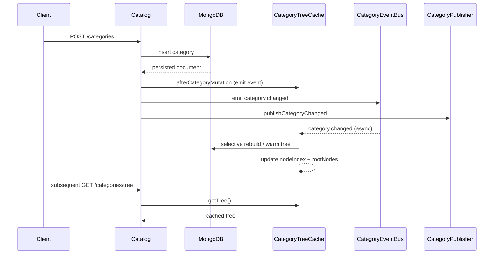
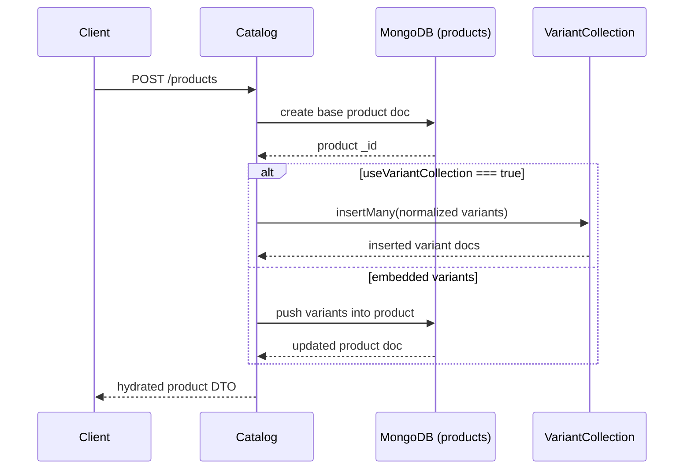

# Catalog Service

## Menu
- [Overview](#overview)
- [Environment Variables](#environment-variables)
- [Key Endpoints](#key-endpoints)
- [Variants & Options](#variants--options)
- [Product Enhancements](#product-enhancements)
- [Category Tree Strategies](#category-tree-strategies)
  - [Database-side Traversal](#database-side-traversal-graphlookup)
  - [Cached Full Tree](#cached-full-tree-redis-or-in-memory)
  - [Selective Branch Rebuilds](#selective-branch-rebuilds)
  - [Hybrid Node Map Cache](#hybrid-node-map-cache)
- [Category Enhancements](#category-enhancements)
  - [Ordering & Visibility](#ordering--visibility)
  - [Cache Invalidation & Fallback](#cache-invalidation--fallback)
  - [Resilience & Observability](#resilience--observability)
  - [Validation & Slug Safety](#validation--slug-safety)
  - [Search Propagation](#search-propagation)
- [TODO](#todo)
---

## Overview
Manage categories, products, and variants (attributes, SKU/price/stock pointers).

## Quick Start
1. **Install & seed**: `npm install`, ensure MongoDB is running with the `catalog` database.
2. **Run + debug**: either `npm run start:dev:catalog -- --inspect=9232` or use the VS Code compound _Run + Debug Catalog_ (launches the service and attaches the debugger automatically).
3. **Smoke-test**: hit `GET http://localhost:3040/catalog/health` to verify the service boots.
4. **Iterate**: leverage the cache + event workflow when editing category logic, and re-run `npm run lint` before pushing changes.

## Environment Variables
| Name | Default | Purpose |
| --- | --- | --- |
| `PORT` | `3040` | HTTP port exposed by the catalog Nest app. |
| `MONGODB_URI` | `mongodb://0.0.0.0:27017/ecommerce` | Connection string for the backing Mongo cluster. |
| `MONGODB_DB` | `catalog` | Database name used for category/product collections. |
| `CATALOG_SERVICE_URL` | _none_ | Public URL so the gateway knows how to reach this service. |
| `CATALOG_EVENTS_QUEUE` | `catalog_events` | RabbitMQ queue used by category & product publishers. |
| `CATALOG_USE_VARIANT_COLLECTION` | `true` | Toggle between embedded variants and the standalone `VariantCollection` model. |
| `RABBITMQ_URL` | `amqp://localhost:5672` | AMQP endpoint for catalog domain events. |
| `CATEGORY_TREE_CACHE_TTL_MS` | `60000` | TTL for `CategoryTreeCacheService` before forcing a rebuild. |

## Key Endpoints
| Method | Path | Purpose |
| --- | --- | --- |
| `GET` | `/catalog/health` | Simple readiness probe for infra monitors. |
| `POST` | `/catalog/categories` | Create a category (slug/parent/locale metadata). |
| `GET` | `/catalog/categories` | Flat list sorted by `sortIndex` + name. |
| `GET` | `/catalog/categories/tree` | Cached hierarchical tree for navigation menus. |
| `PATCH` | `/catalog/categories/:id` | Update metadata, move parents, toggle visibility. |
| `POST` | `/catalog/products` | Create product, options, and optional variants. |
| `GET` | `/catalog/products` | Filter by vendor/status/category, paginate, and sort products (see headers for totals). |
| `GET` | `/catalog/products/:id` | Fetch a single product with variants. |
| `PATCH` | `/catalog/products/:id` | Partial updates (price, options, categories). |
| `PATCH` | `/catalog/products/:productId/status` | Moderation endpoint for pending/approved/rejected workflow. |
| `POST` | `/catalog/products/:productId/variants` | Append a variant; enforces option alignment. |
| `PATCH` | `/catalog/products/:productId/variants/:variantId` | Update SKU/price/stock/attributes for a specific variant. |
| `DELETE` | `/catalog/products/:productId/variants/:variantId` | Remove a variant and re-normalize combination keys. |
| `GET` | `/catalog/products/:productId/variants` | List variants regardless of storage backend. |

Notes: Uses MongoDB via Mongoose; validation via class-validator; admin writes routed through the gateway.

## Variants & Options
- Products can define `options` (array of `{ name, values[] }`). Variant attributes must use only these option names and allowed values.
- Variant option combinations are validated for uniqueness per product.
- Set `CATALOG_USE_VARIANT_COLLECTION=true` to store variants in a dedicated `variants` collection (prefer for products with many variants). Default keeps variants embedded on the product document.
- Updating a product via `PATCH /products/:id` can also replace option definitions; existing variants are normalized against the new definitions and validation will fail if the new options invalidate current variants.

## Product Enhancements

### Variant lifecycle & validation
- `PATCH /products/:productId/variants/:variantId` and `DELETE /products/:productId/variants/:variantId` round out CRUD so admins can correct SKUs, prices, or retire bad combinations.
- DTOs enforce sane bounds (`@IsMongoId`, `@Min(0)` for monetary fields, non-empty attributes) ensuring the API rejects malformed payloads before they reach the database.
- `ProductOptionsService` still normalizes attributes against option definitions during updates, preventing drift even when variants live in the dedicated collection.

### Product events & downstream sync
- `ProductEventBus` mirrors the lightweight in-process emitter used by categories, exposing `product.changed` and `variant.changed` hooks for cache warmers.
- `ProductPublisher` emits `catalog.product.changed` and `catalog.variant.changed` via RabbitMQ so search, inventory, or storefront services can react to moderation or variant updates instantly.
- Event payloads include the entire product snapshot (including variants) plus metadata like `action`, `path`, and combination keys, making downstream upserts idempotent.

### Listing filters & pagination
- `GET /catalog/products` now accepts `vendorId`, `categoryId`, `subCategoryId`, `status`, `page`, `limit`, `sortBy`, and `sortDir` query params (see `ListProductsQueryDto`).
- Responses still stream the product array for backwards compatibility, but four headers provide pagination metadata: `X-Total-Count`, `X-Page`, `X-Limit`, and `X-Has-Next`.
- Filtering happens directly inside Mongo queries, and variant lookups only hydrate the current page to keep latency predictable.

### Category-aware assignments & breadcrumbs
- `POST /catalog/products` and `PATCH /catalog/products/:id` accept an optional `subCategoryId`. The catalog service validates that it refers to a leaf node and belongs to the supplied `categoryId`, rejecting mismatched trees up front.
- Every product response (list + detail) now includes `categoryBreadcrumb`, an ordered array of `{ id, name, slug }` describing the resolved ancestor path so storefronts can render breadcrumbs without extra lookups.
- Product change events and downstream consumers receive the enriched snapshot, so cache warmers/search jobs can stay in sync with parent-child assignments.

### Moderation workflow
- `PATCH /catalog/products/:productId/status` enforces a simple state machine: `pending → approved|rejected`, `approved → rejected`, `rejected → pending`. Duplicate transitions are rejected with a `400` to prevent noisy event emission.
- Every product or variant mutation emits corresponding domain events and is validated via class-validator before Mongoose persists the changes.

## Category tree strategies
Two common approaches exist for delivering the nested category tree that powers storefront navigation and product assignment flows.

### Database-side traversal (`$graphLookup`)
- **Implementation**: Store categories in a single collection where every document has `_id`, `parentId`, and ordering metadata. Expose a query that leverages MongoDB's [`$graphLookup`](https://www.mongodb.com/docs/manual/reference/operator/aggregation/graphLookup/) (or recursive CTEs for SQL) to walk parent/child relationships and materialize the tree in one aggregation. In NestJS, encapsulate the aggregation in a repository method and cache only query parameters/filters.
- **Example**:

  ```ts
  @Injectable()
  export class CategoryRepository {
    constructor(@InjectModel(Category.name) private readonly categoryModel: Model<CategoryDocument>) {}

    async fetchTreeFromDb(root: Types.ObjectId | null = null) {
      const pipeline = [
        root ? { $match: { _id: root } } : { $match: { parentId: null } },
        {
          $graphLookup: {
            from: 'categories',
            startWith: '$_id',
            connectFromField: '_id',
            connectToField: 'parentId',
            as: 'descendants',
            depthField: 'depth',
          },
        },
        {
          $addFields: {
            children: {
              $filter: {
                input: '$descendants',
                as: 'node',
                cond: { $eq: ['$$node.parentId', '$_id'] },
              },
            },
          },
        },
        { $project: { name: 1, slug: 1, parentId: 1, children: 1 } },
      ];

      return this.categoryModel.aggregate(pipeline).exec();
    }
  }
  ```
- **Pros**:
  - No extra infrastructure beyond MongoDB.
  - Tree is always up to date—no cache invalidation races.
  - Pagination and filtering by depth/branch can be handled entirely in the aggregation pipeline.
- **Cons**:
  - Aggregations grow linearly with depth; deeply nested catalogs can incur higher CPU at peak traffic.
  - Harder to share tree snapshots across services; every consumer repeats the aggregation.
  - Requires MongoDB Atlas/Replica set (or similar) tuned for heavier aggregation workloads.

### Cached full tree (Redis or in-memory)
- **Implementation**: Keep the source of truth in Mongo as above, but materialize the full tree whenever categories change. Publish the tree to Redis (e.g., `catalog:categoryTree`) or hydrate an in-memory cache inside the catalog service. Readers hit the cache first; cache invalidation happens on `POST/PATCH/DELETE /categories` events (e.g., via BullMQ or Nest event emitter).
- **Example**:

  ```ts
  @Injectable()
  export class CategoryTreeCache {
    private readonly cacheKey = 'catalog:categoryTree';

    constructor(
      @InjectModel(Category.name) private readonly categoryModel: Model<CategoryDocument>,
      @Inject(CACHE_MANAGER) private readonly cache: Cache,
    ) {}

    async rebuildTree(): Promise<CategoryNode[]> {
      const categories = await this.categoryModel.find().lean().exec();
      const tree = buildTree(categories);
      await this.cache.set(this.cacheKey, tree, 60 * 60); // 1h TTL fallback
      return tree;
    }

    async getTree(): Promise<CategoryNode[]> {
      const cached = await this.cache.get<CategoryNode[]>(this.cacheKey);
      if (cached) {
        return cached;
      }
      return this.rebuildTree();
    }
  }

  // Simplified helper
  function buildTree(nodes: CategoryDocument[]): CategoryNode[] {
    const lookup = new Map<string, CategoryNode>();
    const roots: CategoryNode[] = [];

    nodes.forEach((node) => {
      lookup.set(String(node._id), { ...node, children: [] });
    });

    lookup.forEach((node) => {
      if (node.parentId) {
        lookup.get(String(node.parentId))?.children.push(node);
      } else {
        roots.push(node);
      }
    });

    return roots;
  }
  ```
- **Pros**:
  - Tree reads are O(1) and offload expensive aggregations from Mongo.
  - Easy to broadcast the same snapshot to multiple services (gateway, search indexer, storefront).
  - Enables advanced features like edge caching/CDN of a JSON tree.
- **Cons**:
  - Requires cache infrastructure and clear invalidation strategy.
  - Risk of stale trees if event processing fails; need fallbacks (TTL, periodic rebuild).
  - Larger payloads duplicates data; ensure tree stays small enough for cache limits.

**Recommendation**: Start with database-side traversal while the catalog is small (<1k categories). Introduce the cached tree once reads dominate writes or when multiple downstream consumers need the tree at low latency. Both approaches can coexist by using DB traversal as a fallback when the cache is cold or inconsistent.

### Selective branch rebuilds
- **Implementation**: Instead of rebuilding the whole tree after every mutation, `CategoryTreeCacheService` keeps a normalized map of nodes and mutates the affected branch in-place. The event payload includes the updated `CategoryNode`, so the cache can reparent/move the existing subtree.
- **Code**:

  ```ts
  async applyCategoryMutation(event: CategoryChangedEvent): Promise<void> {
    await this.ensureInitialized();

    if (event.action === 'deleted') {
      this.removeBranch(event.categoryId);
      this.touchTtl();
      return;
    }

    if (!event.category) {
      await this.rebuildTree();
      return;
    }

    if (event.action === 'created') {
      this.insertNode(event.category);
    } else {
      this.updateNode(event.category);
    }
    this.touchTtl();
  }
  ```
- **Pros**:
  - Constant-time updates for category creates/updates—only the impacted branch moves.
  - Listeners keep working even while rebuilds happen in the background; no global cache invalidation pause.
  - Removes most redundant reads from Mongo for high-write catalogs.
- **Cons**:
  - Requires accurate event payloads; if a snapshot is missing (e.g., delete without payload) the listener must fall back to a full rebuild.
  - Slightly more complex bookkeeping to detach/attach parent-child relationships safely.

### Hybrid node map cache
- **Implementation**: The cache stores both (a) a normalized `nodeIndex` map for O(1) lookups and (b) a denormalized `rootNodes` array for fast `GET /categories/tree` responses. The listener mutates the normalized view; `getTree()` simply clones the denormalized tree.
- **Code**:

  ```ts
  type MutableCategoryNode = CategoryNode & { children: MutableCategoryNode[] };

  export class CategoryTreeCacheService {
    private readonly nodeIndex = new Map<string, MutableCategoryNode>();
    private rootNodes: MutableCategoryNode[] = [];

    private insertNode(snapshot: CategoryNode): void {
      const node = this.createMutableNode(snapshot);
      this.nodeIndex.set(node.id, node);
      this.attachToParent(node);
    }

    private attachToParent(node: MutableCategoryNode): void {
      if (node.parentId) {
        const parent = this.nodeIndex.get(node.parentId);
        if (parent) {
          parent.children.push(node);
          this.sortChildren(parent.children);
          return;
        }
      }
      this.rootNodes.push(node);
      this.sortChildren(this.rootNodes);
    }

    async getTree(): Promise<CategoryNode[]> {
      await this.ensureInitialized();
      return this.cloneNodes(this.rootNodes);
    }
  }
  ```
- **Pros**:
  - Mixes the best of both worlds: O(1) node lookups plus a ready-to-serve tree.
  - Enables future APIs (e.g., `GET /categories/:id/branch`) without additional DB calls.
  - Makes cache invalidation cheaper because only normalized structures change.
- **Cons**:
  - Slightly higher memory usage (tree + map) on the catalog service.
  - Needs defensive cloning before returning data to avoid accidental external mutations.

## Category Enhancements

### Ordering & Visibility
- `CategoryEntity` now stores `slug`, `sortIndex`, `isVisible`, and localized labels (map of `{ locale: label }`).
- Requests may pass `sortIndex`, `isVisible`, and locale labels via the category DTOs; the API persists them and `buildCategoryTree` sorts siblings by `sortIndex` + name.
- Schema sketch:

  ```ts
  @Schema({ timestamps: true })
  export class CategoryEntity {
    @Prop({ required: true })
    name!: string;

    @Prop({ required: true, unique: true })
    slug!: string;

    @Prop({ type: Number, default: 0 })
    sortIndex = 0;

    @Prop({ type: Boolean, default: true })
    isVisible = true;

    @Prop({ type: Map, of: String })
    localeNames?: Record<string, string>;

    @Prop({ type: Types.ObjectId, ref: CategoryEntity.name, default: null })
    parentId?: string;
  }
  ```

- Example payload:

  ```json
  {
    "name": "Shoes",
    "sortIndex": 5,
    "isVisible": true,
    "localeNames": [
      { "locale": "en-US", "label": "Shoes" },
      { "locale": "es-ES", "label": "Zapatos" }
    ]
  }
  ```
  > The API maps the `localeNames` array into the schema's internal `Map<string, string>` format.

### Cache Invalidation & Fallback
- `CategoryTreeCacheService` caches `CategoryNode[]` in memory (or Redis) for `CATEGORY_TREE_CACHE_TTL_MS`; `listCategoryTree` prefers the cache but rebuilds on errors.
- Category writes emit a `category.changed` event via the lightweight `CategoryEventBus`. `CategoryEventsListener` subscribes to the bus and warms the cache outside of the mutation transaction.
- Example emission from `AppService.afterCategoryMutation`:

  ```ts
  const mapped = mapCategory(category);
  this.categoryTreeCache.clear();
  this.categoryEvents.emitCategoryChanged({
    categoryId: mapped.id,
    action,
  });
  ```

- Listener warms the cache and logs any problems:

  ```ts
  @Injectable()
  export class CategoryEventsListener implements OnModuleInit, OnModuleDestroy {
    private readonly handler = (event: CategoryChangedEvent): void => {
      this.categoryTreeCache
        .rebuildTree()
        .then(() => this.logger.debug(`Tree cache rebuilt after ${event.action}`))
        .catch((error) => this.logger.warn(`Failed to rebuild tree cache: ${error.message}`));
    };

    onModuleInit() {
      this.categoryEventBus.onCategoryChanged(this.handler);
    }

    onModuleDestroy() {
      this.categoryEventBus.offCategoryChanged(this.handler);
    }
  }
  ```

- Errors rebuilding the cache are logged and a cold DB traversal via `buildCategoryTree` provides a fallback.

  ```ts
  return this.categoryTreeCache.getTree().catch(async (err) => {
    this.logger.warn(`Cache unavailable, falling back to DB: ${err.message}`);
    const categories = await this.categoryModel.find().lean().exec();
    return buildCategoryTree(categories.map(mapCategory));
  });
  ```

### Resilience & Observability
- `CategoryTreeCacheService` exposes health metadata (last rebuild timestamp, duration) so `/health` and logs capture cache freshness.
- Resilient wrappers ensure Redis outages or aggregation errors degrade gracefully, emitting metrics for alerting.

  ```ts
  async rebuildTree(): Promise<CategoryNode[]> {
    const categories = await this.categoryModel.find().lean().exec();
    const tree = buildCategoryTree(categories.map(mapCategory));
    try {
      await this.cacheManager.set(this.cacheKey, tree, this.ttlMs / 1000);
      this.metrics.recordCacheRefresh('categoryTree', true);
    } catch (error) {
      this.logger.error('Failed to persist category tree cache', error as Error);
      this.metrics.recordCacheRefresh('categoryTree', false);
    }
    return tree;
  }
  ```

### Validation & Slug Safety
- Slugs derive from the name (`category.slug = ensureUniqueSlug(slugify(name))`) unless explicitly provided; conflicts append `-1`, `-2`, etc.
- `validateParentAssignment` prevents cycles by walking parent chains; it also ensures parents exist before insert/update.
- `PATCH /categories/:id` supports re-parenting, visibility toggles, localized labels, and explicit slug overrides while still guaranteeing uniqueness.

```ts
if (dto.parentId !== undefined) {
  await this.validateParentAssignment(id, dto.parentId ?? null);
  category.parentId = dto.parentId ?? null;
}
```

### Search Propagation
- `CategoryPublisher` emits `catalog.category.changed` via RabbitMQ (`CATALOG_EVENTS_QUEUE`).
- Payload includes the category path (root → leaf slugs), making it trivial for search/indexing services to remap breadcrumbs.

```ts
await this.categoryPublisher.publishCategoryChanged({
  categoryId: mapped.id,
  slug: mapped.slug,
  name: mapped.name,
  parentId: mapped.parentId,
  sortIndex: mapped.sortIndex,
  isVisible: mapped.isVisible,
  path,
  action,
});
```

## Service implementation overview

### Category workflows
- **Creation (`createCategory`)**: Normalizes optional parent IDs, guarantees slug uniqueness, sets `sortIndex` defaults, and persists localized labels before fanning out cache + domain events via `afterCategoryMutation`.
- **Listing (`listCategories` / `listCategoryTree`)**: Flat list endpoint sorts by `sortIndex` + name for admin UIs, while the tree endpoint prefers `CategoryTreeCacheService` and falls back to Mongo + `buildCategoryTree` on cache misses.
- **Updates (`updateCategory`)**: Reuses helpers for slug regeneration, parent validation, ordering/visibility toggles, and locale maps; all mutations trigger cache invalidation and RabbitMQ notifications.
- **Guards**: `validateParentAssignment` prevents self-parenting/cycles, `ensureUniqueSlug` appends numeric suffixes to avoid collisions, and `computeCategoryPath` builds breadcrumbs for downstream consumers.

### Product & variant workflows
- **Creation (`createProduct`)**: Confirms the category exists, normalizes option definitions, enforces unique variant combination keys through `buildVariant`, and supports both embedded variants and the dedicated `VariantCollection` (controlled by `useVariantCollection`).
- **Listing (`listProducts`, `getProduct`)**: Filters by vendor/status, hydrates variants either from the product document or by batching lookups from the variant collection, and maps everything into DTO-friendly shapes.
- **Variants (`addVariant`, `listVariants`)**: Validates option alignment via `normalizeAttributesForOptions`, enforces uniqueness with deterministic combination keys, and writes to the proper storage layer.
- **Updates (`updateProduct`, `updateProductStatus`)**: Applies partial updates, revalidates category moves, and when options change, `reconcileVariantsForOptions` renormalizes existing variants (bulk writes for collection mode or `$set` on embedded arrays).

### Cross-cutting concerns
- **Cache + events**: `afterCategoryMutation` emits lightweight cache invalidation events through `CategoryEventBus` and publishes enriched messages through `CategoryPublisher`, so cache rebuilds and other services stay decoupled from write latency.
- **Validation & normalization**: Helper methods (`slugify`, `normalizeLocaleNames`, `normalizeOptionDefinitions`, etc.) centralize input shaping and raise `BadRequestException`/`ConflictException` when clients submit invalid data.
- **Error handling**: Nest exceptions translate into HTTP responses automatically; unexpected cache/event failures are logged via the injected `Logger` while core writes succeed.

### Sequence diagrams




### Reference snippets
- Variant normalization + reconciliation entry point:

  ```ts
  async reconcileVariantsForOptions(productId: string, options: OptionDefinition[]): Promise<void> {
    if (options.length === 0) {
      return;
    }

    if (this.useVariantCollection) {
      await this.reconcileCollectionVariants(productId, options);
      return;
    }

    await this.reconcileEmbeddedVariants(productId, options);
  }
  ```
- Selective cache mutation guard (excerpt):

  ```ts
  async applyCategoryMutation(event: CategoryChangedEvent) {
    await this.ensureInitialized();
    if (event.action === 'deleted') {
      this.removeBranch(event.categoryId);
      return;
    }

    if (!event.category) {
      await this.rebuildTree();
      return;
    }

    event.action === 'created'
      ? this.insertNode(event.category)
      : this.updateNode(event.category);
  }
  ```

## TODO
- [x] Wire `CategoryTreeCacheService` + event-driven invalidation in `AppService` (create/update/delete flows).
- [ ] Add integration tests for slug uniqueness, cycle prevention, and cache fallback logging.
- [ ] Add indexes (categoryId, sku) and search integration.
- [ ] Add pricing rules (discounts, tax classes) and media (images).
- [ ] Add slugs/SEO fields and soft-delete/archive for products.
- [ ] Plan `ProductPublisher` + product events listener mirroring the category flow to broadcast product mutations.
- [ ] Add unit tests for `ProductOptionsService` and `ProductMapper` helpers to lock normalization logic.
- [x] Document catalog API endpoints (Swagger decorators + Swagger UI at `/docs`) for easier discoverability.
- [x] Support explicit `subCategoryId` (leaf + parent validation) on products so storefronts can query parent/child assignments without extra lookups.
- [x] Return category breadcrumb metadata on product responses to avoid recomputing parent chains on every client request.